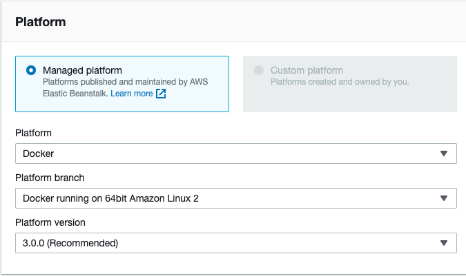
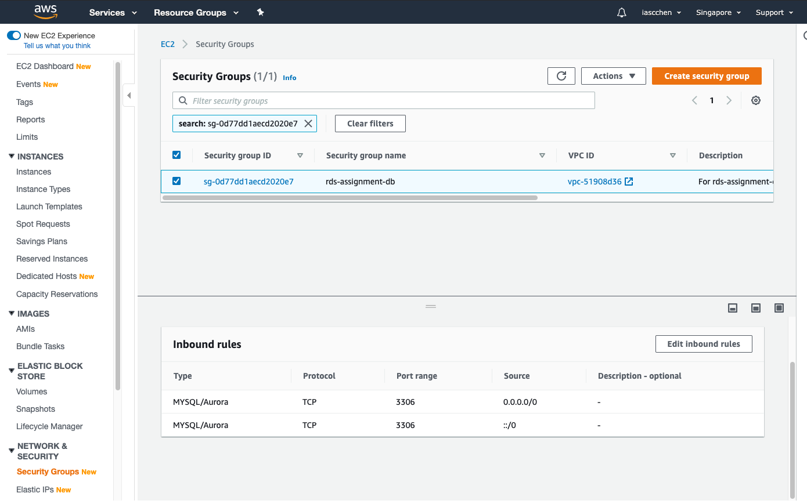
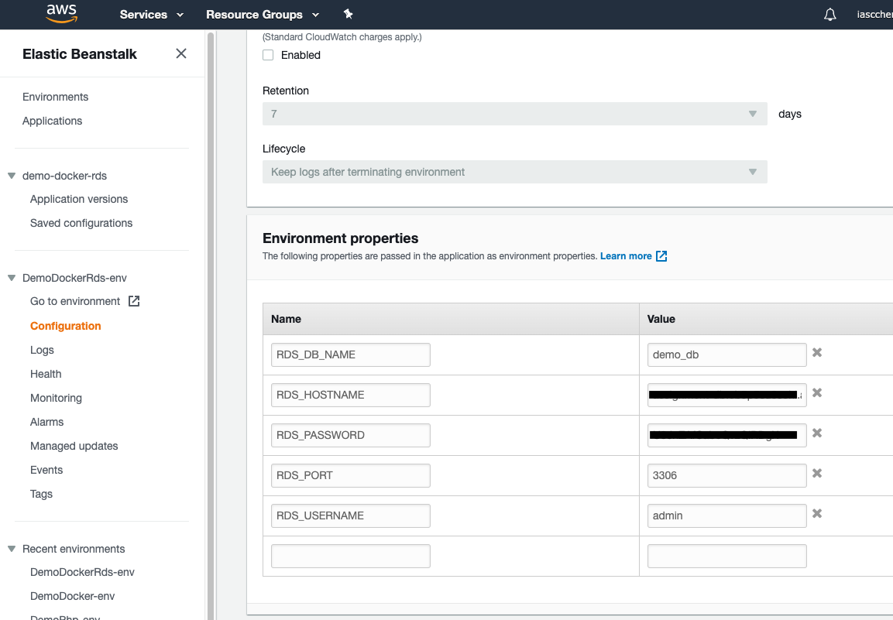

# Php + MySQL(RDS) for AWS Elastic Beanstalk

With AWS Elastic Beanstalk : Single Container Docker environments

## Local Test Commands

Build Docker

    docker build -t my-php-mysql .
    
Start a new Docker container
    
    docker run -d --name my-app -p 8000:80 my-php-mysql

After build, create a new container 
    
    docker stop my-app && docker rm $_ && docker run -d --name $_ -p 8000:80 my-php-mysql
    
Access [http://localhost:8000/](http://localhost:8000/)

## Some Tips

1. Zip this folder, and deploy to Elastic Beanstalk.
    
        zip -r '../aws-eb-php-mysql.zip' *
    
2. Enable PHP other Module, please add this sentence in `Dockerfile` :

        RUN docker-php-ext-install mysqli

3. Please make sure your EC2 instance can access RDS DB currently. Please check RDS "Security Groups"

    

4. Should add these info in "Elastic Beanstalk" / "Env Configuration" 。Setting "Software" as follows:

    
    
    Here are DB connection code in PHP
    
          <?php
           define('DB_HOST', getenv('RDS_HOSTNAME'));
           define('DB_PORT', getenv('RDS_PORT'));
           define('DB_USER', getenv('RDS_USERNAME'));
           define('DB_PASSWORD', getenv('RDS_PASSWORD'));
           define('DB_NAME', getenv('RDS_DB_NAME'));
        
           echo '
';
           echo DB_HOST; echo ' , ';
           echo DB_PORT; echo ' , ';
           echo DB_USER; echo ' , ';
           echo DB_NAME; echo ' , ';
           echo '
';
        
           // Create connection
           $conn = new mysqli(DB_HOST, DB_USER, DB_PASSWORD);
        
           // Check connection
           if ($conn->connect_error) {
               die("
Connection failed: " . $conn->connect_error . "
");
           }
           echo "
Connected successfully
";
           ?>
